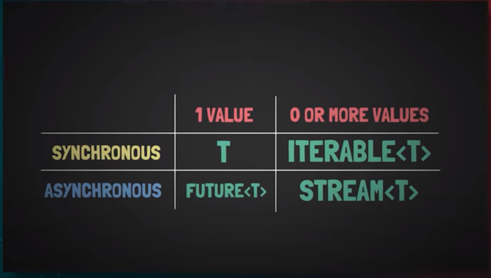
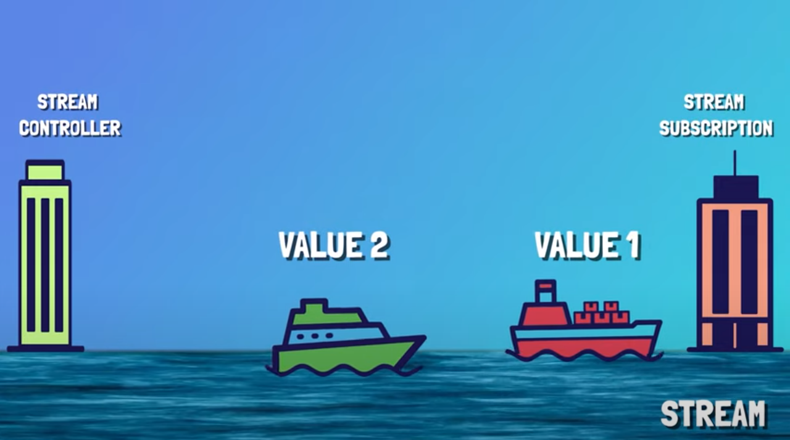
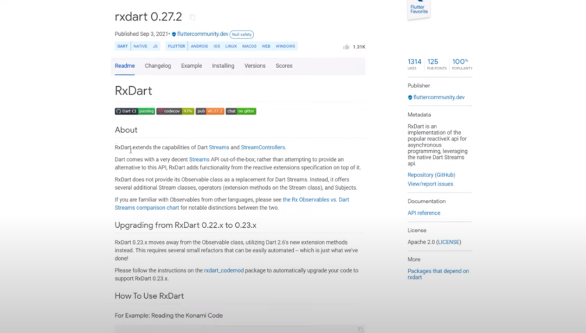

#  (22.2) Streams in-depth

**Description** : Puts the vector in increasing or decreasing order
**Example**:



So compare to features returning one single value in the future streams similarly to iterables can return zero one or multiple values the difference between streams and iterables though is that streams values are not returned ynchronously right away one by one but rather asynchronously in the future.

in order to understand this easier let me show you one of the simplest streams you can implement we're going to use the periodic name constructor to achieve this basically without looking into the documentation what this line of code actually does is emitting values from 0 to infinite with a delay of 1 second between them if we run the program right now we can see that nothing gets printed this is because just like in the case of a future the values coming down the stream need to be listened to if features had the then callback well
streams have a similar function called listen as a result we can call listen on our newly created stream so that whenever a new value will be emitted down the stream this listen function will be called and the closure inside will be executed therefore printing the
value if we run the program again right now we can see the stream in action just notice how each value comes down the stream one after another this is the concept of a stream

```dart
import 'dart:async';

Future main(List<String> args) async {
  Stream.periodic(const Duration(seconds: 1), (x) => x).listen(print);
}

```
**[See Sample code](../snippets/vector/sort.cpp)**
**[Run Code](https://rextester.com/FFTEBY25900)**

Now in order to see that this is actually happening asynchronously in the background why don't we create another stream in the case of which we'll emit negative values from 0 to infinite every 2 seconds now you can clearly see if we run this program that for each two positive values we get a third negative value this is because the first stream is emitting values each second and the second one is doing it every two seconds while they're both running asynchronously in the background.


```dart
import 'dart:async';

Future main(List<String> args) async {
  Stream.periodic(const Duration(seconds: 1), (x) => x).listen(print);
  Stream.periodic(const Duration(seconds: 2), (x) => -x).listen(print);
}
```
**[See Sample code](../snippets/vector/sort.cpp)**
**[Run Code](https://rextester.com/FFTEBY25900)**

And observing what we previously discussed about features we know that features complete with a value in the future right as a result we can actually construct a stream from a bunch of features using the from futures constructor note the asynchrony support again since if we set these two features as a parameter to the constructor they will be printed again in the right order since the future that value will complete first therefore it will be added to the stream earlier than the normal feature i want you to observe how everything starts to make sense right


```dart
import 'dart:async';

Future main(List<String> args) async {

  Stream.fromFutures([Future(() => 3), Future.value(2)]).listen(print);

}
```
**[See Sample code](../snippets/vector/sort.cpp)**
**[Run Code](https://rextester.com/FFTEBY25900)**


now generally speaking when we talk about a stream we should think of it really as a stream of water you can think of the values emitted down the stream as being some ships containing those values of course those ships are added to the stream by some authority they can't simply appear out of nowhere and they obviously need to have a destination dock where someone expects them aka listens to the values coming down the stream the authority adding them to the stream is the stream controller while the dock expecting every boat to arrive is a stream subscription know that by default only a single stream subscription can listen to a stream the stream needs to be a broadcast stream so that multiple subscriptions can listen to it




```dart
import 'dart:async';

Future main(List<String> args) async {
  final streamController = StreamController<int>();

  var value = 0;
  Timer.periodic(const Duration(seconds: 1), (timer) {
    streamController.add(value++);
  });

  streamController.stream.listen(print);
}
```
**[See Sample code](../snippets/vector/sort.cpp)**
**[Run Code](https://rextester.com/FFTEBY25900)**

having all these components in mind you need to know that you can use them to create a stream of your own for example the first object we need to create is the stream controller instance as i said this is the authority that's able to add ships down the stream by creating a stream controller we're actually linking it to a stream because a stream controller will always compact with a stream as you can see we can actually access it by typing in streamcontroller.stream this is a getter returning the created stream so currently we have initialized the stream and the stream controller but how is this controller going to add ships with data down the stream well for this we need to use the add method from inside the stream controller class we want to achieve the same behavior we had with our stream.periodic constructor as a result we'll create a timer object with the help of periodic constructor this timer will execute this callback for every second for an undetermined amount of time in our case so before the timer runs we can create an integer value and assign it to 0 then for every tick of this timer we can add the current value to the stream by using the streamcontroller.add method and then increment the value remember from long ago if we had plus plus value instead then the value would have been incremented before being added to the stream so we implemented the stream controller the stream and programmed how the controller adds new values down the line but now we need to set up the dock listening to the stream as a result we'll just type streamcontroller.stream.listen and for each of the received values we'll print them just as before now if we run the program we can observe we have the same functionality just as with the stream that period deconstructor but at least now you know the functional components of a stream

note that this listen function returns a stream subscription just as we discussed so we can actually assign it to a variable but now dart shows us this warning mentioning that we haven't written a line of code that's going to close this subscription when they won't need to listen anymore to the stream this is a vital concept to be understood when you  create a stream subscription object it
won't stop listening to the stream until you'll manually cancel it ideally you'd want to cancel it after you're not interested in the values of the stream anymore or whenever the stream won't
simply emit any more values so for example in our case if our value ends up being 5 then we'll cancel the timer as well as the stream as you can see from the code right now as a result the
stream won't emit any new values anymore but the stream subscription object will still be listening to the stream which can lead to memory leaks so if the value becomes 5 then we'll also cancel the
stream subscription now the warning is gone and everything works just as it should be what i want you to also understand is that by default only a single stream subscription can listen to
our stream if we try to create another one listening to it and run the program dart will throw a bad state exception mentioning that this stream has been already listened to in order to have
multiple stream subscription listening to the same stream the stream needs to be a broadcast stream as a result we must create a stream controller with the help of the broadcast constructor now if
we go ahead and run the program we can see that both of these stream subscriptions listen to the same stream therefore printing each value twice so i hope you kind of understood the main components of a stream.


```dart
import 'dart:async';

Future main(List<String> args) async {
  final streamController = StreamController<int>();

  var value = 0;
  Timer.periodic(const Duration(seconds: 1), (timer) {
    if (value == 5) {
      timer.cancel();
      streamController.close();
    } else {
      streamController.add(value++);
    }
  });

//   var max = 0;
//   await streamController.stream.forEach((value) {
//     max = (value > max) ? value : max;
//   });
//   print('Max is --> $max');

  var max = 0;
  await for (final value in streamController.stream) {
    max = (value > max) ? value : max;
  }
  print('Max is --> $max');
}
```
**[See Sample code](../snippets/vector/sort.cpp)**
**[Run Code](https://rextester.com/FFTEBY25900)**


but now the same question arises just as in the case of futures do we know exactly the moment when a value will come down the stream maybe we'll need for example to retrieve the biggest value emitted by the stream how are we going to do that obviously we'll need to await for the values of the stream in order to calculate which one is the largest as we don't really know when each of the values will arrive to the stream subscription we will comment the stream subscription implementation for the moment so we know that in order to wait for a single future to complete we use the await keyword but remember a stream will return multiple values as a result we will need to use an await for structure so for each value we're waiting for we can calculate the maximum value directly and when the stream will get closed then the await4 will also exit and dart will print the max value on the screen
```dart
import 'dart:async';

Future main(List<String> args) async {
  final streamController = StreamController<int>.broadcast(); /*<---*/
  final streamSubscription = streamController.stream.listen(print);
  final otherStreamSubscription = streamController.stream.listen(print);

  var value = 0;
  Timer.periodic(const Duration(seconds: 1), (timer) {
    if (value == 5) {
      timer.cancel();
      streamController.close();
      streamSubscription.cancel();
    } else {
      streamController.add(value++);
    }
  });

  var max = 0;
  await streamController.stream.forEach((value) {
    max = (value > max) ? value : max;
  });

}
```
**[See Sample code](../snippets/vector/sort.cpp)**
**[Run Code](https://rextester.com/FFTEBY25900)**

we can also achieve this again by using the for each method directly so that for each value we retrieve we calculate the new maximum but don't forget to await for it to loop through all stream values you see streams are really similar to features in many ways as instead of returning a single value in the future streams may return 0 1 or even multiple values in an asynchronous manner streams are a huge topic to discuss and it would take me ages to do so i'm trying to show you the major concepts so that you'll start a journey of understanding them with a solid foundation you need to know that we're not done talking about the methods on how you can create a stream of data yet i want you to remember from my previous tutorial how we were able to create an iterable by using a synchronous generator function well in the same manner we can create a stream of multiple values by using an asynchronous generator function as we're going to see up next so creating an asynchronous generator function is absolutely similar to creating a synchronous one just as we saw in the previous tutorial this time though the return type won't be an iterable but rather a stream and the keyword won't be sync star but rather async star let's say for example we want this async generator function to generate values from 0 to 4 onto the stream to achieve this we'll have to use a standard for loop from 0 to 5 and then use the same yield keyword to add the values down the stream this is just like we were calling the stream controller that admitted before

```dart
void main(List<String> args) {
  asyncGenerator().listen(print);
}

Stream<int> asyncGenerator() async* {
  for (var i = 0; i < 5; i++) {
    yield i;
  }
}
```
**[See Sample code](../snippets/vector/sort.cpp)**
**[Run Code](https://rextester.com/FFTEBY25900)**

obviously since this generator returns a stream we can call the listen method on it and print each of the elements we will retrieve if we want them to be a little bit delayed we can actually await a feature that delayed with a duration of one second inside the async generator


```dart
void main(List<String> args) {
  asyncGenerator().listen(print);
}

Stream<int> asyncGenerator() async* {
  for (var i = 0; i < 5; i++) {
    await Future<void>.delayed(const Duration(seconds: 1));
    yield i;
  }
}
```
**[See Sample code](../snippets/vector/sort.cpp)**
**[Run Code](https://rextester.com/FFTEBY25900)**


 it's that easy oh and also similarly to how a synchronous generator could yield another generator with the yield star keyword the same happens in the case of an current generator we could for example yield another stream within our mainstream just like this and everything will work just as expected i want you to understand and see by yourself how abstract and interesting streams can get they can be really useful in multiple scenarios and they represent the foundation of reactive programming a design paradigm that relies on asynchronously programming logic to handle real-time updates to otherwise static content we'll use streams all the time in future flutter tutorials


```dart
void main(List<String> args) {
  asyncGenerator().listen(print);
}

Stream<int> negativeStream =
    Stream<int>.periodic(const Duration(milliseconds: 500), (x) => -x);

Stream<int> asyncGenerator() async* {
  for (var i = 0; i < 5; i++) {
    await Future<void>.delayed(const Duration(seconds: 1));
    yield i;
  }
  yield* negativeStream;
}
```
**[See Sample code](../snippets/vector/sort.cpp)**
**[Run Code](https://rextester.com/FFTEBY25900)**


  if you want to learn more about the power of streams i would highly suggest you to go right ahead and check out the eric's dart package a package

  
  that will provide so much more functionality to the already impressive dart streams api and perhaps let you understand more concepts about what can be done with streams having this said i think it's finally time to end this dart sink and async chapter i hope you understood everything in great detail at least the foundation you need to perfect your skills in becoming a dart and flutter expert we have finally arrived at the end of this amazing dart from novice to expert tutorial series with everything we learn in this course i will create a small and interesting command line application that will help you understand and practice every concept in detail however this tutorial video as well as other future updates on dart will only be available to those of you buying the full dart course i'll launch in the following week on udemy so stay tuned for that i want to thank everyone for watching this amazingly long series of learning dart from a novice to definitely an expert level and i hope you really enjoyed every single tutorial i've made thank you as always if you like this tutorial don't forget to smash that like button subscribe to my channel and share the video with all of your friends and colleagues in pursuit of top tier development until next time as always take care wicked is out bye bye
